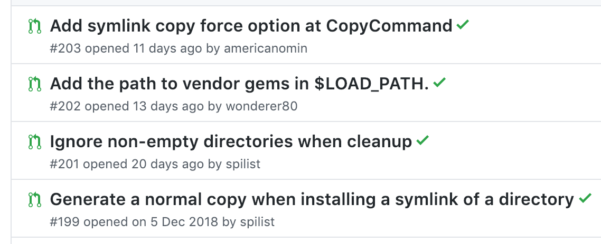
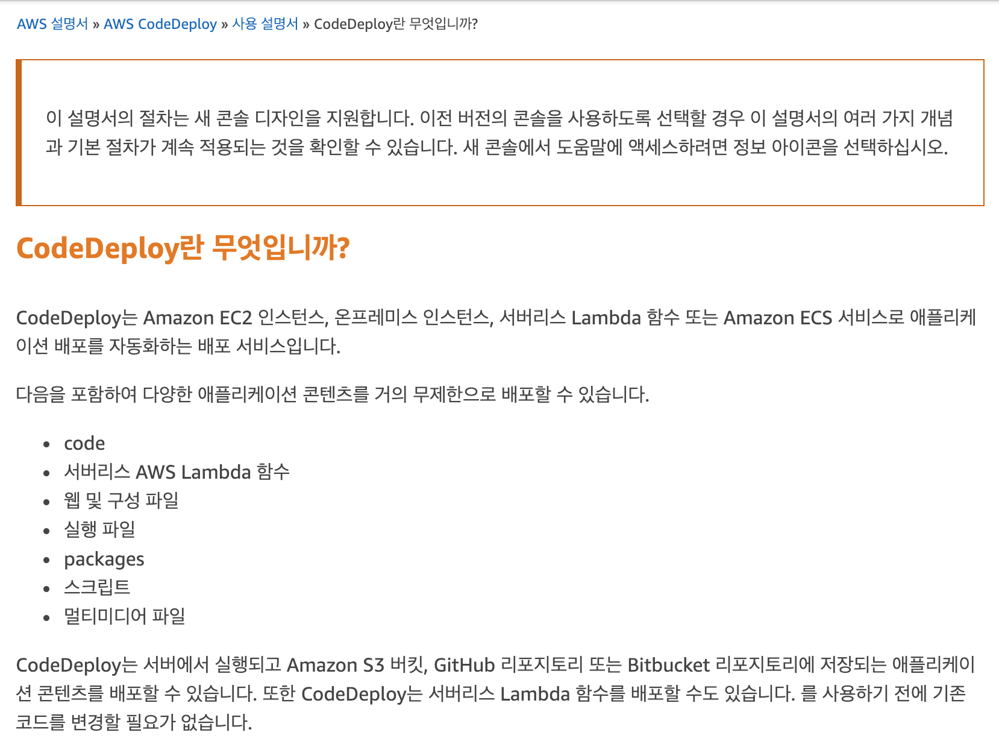
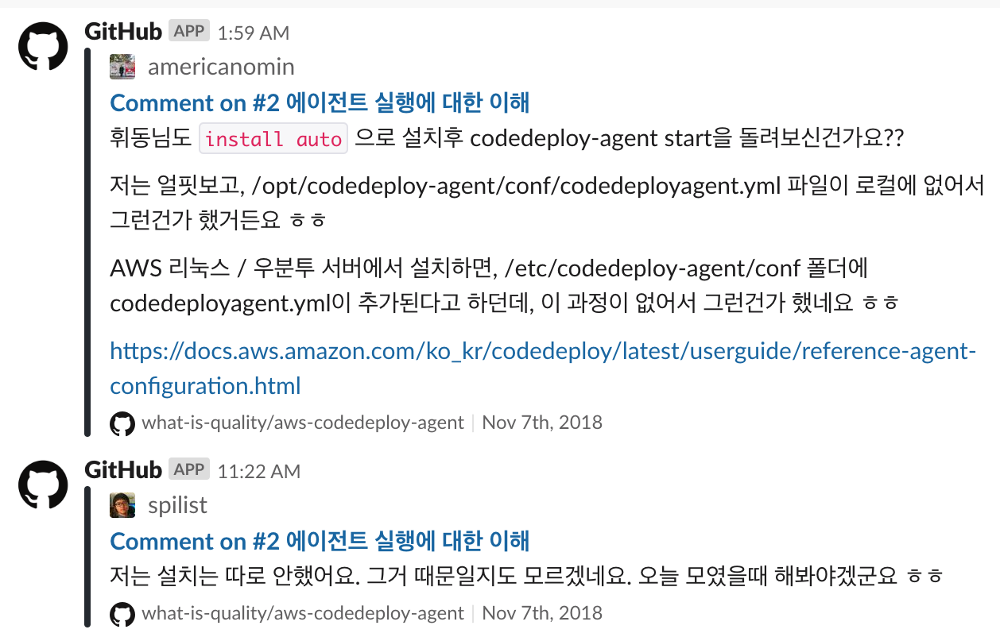

작년 8월 초부터 전 직장 동료이자 절친인 [김정훈님](https://wonderer80.github.io/), [이지민님](http://americanopeople.tistory.com/)과 함께 매주 수요일 저녁에 스터디를 하고 있습니다. 첫 이터레이션(10주)에는 [제랄드 와인버그](https://en.wikipedia.org/wiki/Gerald_Weinberg) 옹의 [Quality Software Management](https://www.amazon.com/Quality-Software-Management-Systems-Thinking/dp/0932633722)(QSM)라는 고전을 함께 읽으며 토론했습니다. 그 다음 이터레이션(12주)은 오픈소스 스터디였는데, 이 기간동안에 [AWS CodeDeploy](https://aws.amazon.com/ko/codedeploy/)라는 아마존의 코드 배포 서비스의 버그들을 분석해서 Pull Request 네 개를 올렸습니다.

이 스터디에서 우리의 공통된 목표는 "오픈소스에 작은 기여를 해봄으로써 자신감을 얻기"였습니다. 스터디 참여자 모두 오픈소스 프로젝트를 사용만 해봤지, 소스코드를 깊게 분석해보거나 제대로 기여를 해본 경험은 이 때까지 없었기 때문이죠. 처음에는 AWS라는 이름값에 막연하게 떨기도 하고, 복잡한 소스코드를 보며 이해하기 어려워했습니다. 하지만 함께 고생하면서 좌충우돌 끝에 첫 PR을 날리고, 마침내 각자가 하나씩 버그를 맡아서 PR을 올리고 나니 정말 뿌듯했습니다. 첫 PR로부터 한달이 넘게 지났음에도 머지가 안됐다는 게 안타까울 따름이지만, 자신감을 얻는다는 목적은 충분히 달성했습니다.

길지 않은 시간이었으나 스터디를 하며 이런 생각을 했습니다.

- 유명한 오픈소스라도 생각보다 훨씬 더 결함이 많고, 코드 품질이 낮다.
- 많은 사람들이 자신의 문제를 리포트하지만, 이들 중 문제의 원인을 파고드는 사람은 많지 않다.
- 문제 원인이 밝혀졌더라도 직접 문제를 해결하려고 하는 사람은 더 적다.
- 따라서, 끈기만 있다면 **초심자라도 충분히 의미있는 기여를 할 수 있다**.

겨우 오픈소스 프로젝트 하나였지만, 스터디 과정에서 오픈소스가 막연한 무지의 대상이 아니라, **생각보다 별 거 아닌**, 우리가 이해할 수 있고 고칠 수도 있는 대상으로 변했다는 것이 기쁩니다. 예전에는 문제가 있을 때 구글링하거나 기존 이슈를 찾아보는 정도였다면, 이제는 이슈를 생성하기도 하고 여차하면 PR을 올릴 수 있게 됐습니다. 괜찮아 보이는 프로젝트가 있으면 괜히 Star를 눌러놓기도 하고요. 패러다임이 바뀐 셈이죠. 실제로 스터디 이후 각기 다른 프로젝트에 작은 PR 두 개([#1](https://github.com/rubyide/vscode-ruby/pull/407), [#2](https://github.com/jbodah/suggest_rb/pull/3))를 올려 둘 다 머지되는 기쁨을 누렸습니다. 

개발자로서 지금까지 커뮤니티에게 받은 혜택을 돌려주고, 또 모르는 사람으로부터 감사와 칭찬을 받는다는 건 정말 즐거운 경험이더군요. 저는 [나는 어떻게 오픈소스 커뮤니티를 통해 성장했나](https://blog.cometkim.kr/posts/mattermost-contribution/how-i-grow-up-with-mattermost-community/)를 읽고 오픈소스 기여에 관심이 생기고, 또 스터디까지 하게 됐는데, 우리의 스터디 기록도 또 다른 누군가를 오픈소스 기여자로 만드는 단초가 되면 좋겠네요.

### 스터디 주제 선정 ###

QSM Volume 1-1 스터디를 끝내고 회고를 하며 다음 스터디는 어떤 주제로 할지 논의했습니다. 여러가지 후보가 있었는데:

1. QSM, 또는 와인버그의 다른 책을 비슷한 방식으로 이어서 읽기
2. 백엔드 기술 전문성을 높이는 활동 (커리어 선택의 폭 넓히기)
3. 공동으로 글쓰기 (팀블로그)
4. 공동으로 스택오버플로우 답변달기
5. 퍼실리테이션, 팀빌딩 액티비티 실습
6. 오픈소스 프로젝트 만들어서 개밥먹기로 학습
7. 강의자료, 학습자료 만들기
8. **기존의 오픈소스 프로젝트 코드 분석해서 코멘트 남기고 PR 올려보기. + 이슈 답변 달아주기**

카페에서 즐겁게 수다만 떨다가 이때는 기록을 안해서...; 어쩌다가 오픈소스로 결정됐는지는 잘 기억나지 않지만, 책으로 스터디를 해봤으니 이번에는 다른 쪽으로 해보자는 것에는 빠르게 합의했던 것 같습니다. 특히 모두 백엔드 개발자였기에, 백엔드 프로그래밍과 관련된 주제로 스터디하고 싶었습니다.

### 대상 프로젝트 선정 ###

그 다음 주에는 각자 몇가지 깃헙 저장소를 후보로 가져왔습니다. 후보는 [Elasticsearch](https://github.com/elastic/elasticsearch), [AWS CodeDeploy Agent](https://github.com/aws/aws-codedeploy-agent), [Rspec](https://github.com/rspec/rspec) , [redis](https://github.com/antirez/redis), [Git](https://github.com/git/git), [Pytest](https://github.com/pytest-dev/pytest), [Redash](https://github.com/getredash/redash), [Django Oscar](https://github.com/django-oscar/django-oscar) 정도가 있었고요. 스터디 참여자들이 주로 다뤄왔던 언어가 Ruby였던 관계로, C로 구현된 프로젝트는 모두 순식간에 제외되었습니다. 그래도 여전히 후보가 많아서 선택하기 어려웠는데, 선택의 폭을 좁혀준 것은 이 기준이었습니다. "**커밋 수가 가장 적은 프로젝트**".

우리는 실제 문제를 푸는 데 기여하고 싶었지만, 스터디에 너무 많은 시간을 투자해야 하면 부담이 커지면서 지속하기 어려워진다는 것을 다들 알고 있었습니다. 그래서 레거시가 적고 파악해야 하는 코드 양이 적은 프로젝트를 선택하고자 했습니다. [AWS CodeDeploy Agent](https://github.com/aws/aws-codedeploy-agent)는 커밋 수도 적고 역사도 깊지 않았으며, 작년 10월까지만 해도 개발이 활발하게 이루어지고 있는 것으로 보였습니다. 게다가 소스코드도 Ruby로 되어있었고, 우리 모두 AWS에 관심이 있었으니 훌륭한 선택이라고 생각했습니다. 이때는 지난 몇 달간 아무 반응 없이 방치된 PR도 많다는 현실은 몰랐죠...

*CodeDepoy 같은 서비스도 오픈소스로 올라와있다는 것에 놀랐습니다.*

### 스터디에서 기대하는 바 공유 ###

스터디든 미팅이든, 둘 이상이 함께하는 활동에서는 (어쩌면 혼자라도) 각 구성원이 이 활동에서 무엇을 기대하는지 함께 명시적으로 공유하는 게 무척 중요하다고 생각합니다. 공동의 목표를 정할 때는 물론이고 각자의 말과 행동, 생각을 이해하는 데에도 큰 도움이 되니까요.

기대하는 바, 또는 목표는 모임이 진행되고 구성원의 이해도가 높아지면서 바뀌기 마련인데, QSM 스터디에서도 처음 목표는 꽤 단순했습니다. 그러다가 중간회고를 하면서 우리가 스터디에서 기대하는 바가 훨씬 멋진(?) 방향으로 바뀌었다는 걸 깨닫고, 이후에는 바뀐 기대를 매 스터디마다 달성하려고 노력했습니다.

> 1회차: 그저 완독! 각자의 경험을 토대로 이야기하기. 영어로 된 소프트웨어 서적 하나를 끝까지 읽기.
> → 6회차: 시야를 넓히고, 통찰력을 얻기. 책에서 학습한걸 시도해볼 수 있는 에너지를 충전하기.

이번 오픈소스 스터디에서는 각자 기대하는 바가 이러했습니다. 결과가 어땠는지는 **회고**에서 적어보도록 하죠.

- 정훈
  -  `codedeploy-agent`에 기여하기. (코드 상태 자체가 별로 안좋아서 쉽게 기여할 여지가 있어 보인다)
  - 코드 이해도를 높여서 `codedeploy-agent`에서 웬만한 이슈를 대응할 수 있는 상태가 되기.
  - Rails가 아닌 환경에서 도는 복잡한 데몬 스크립트에 대한 이해 높이기.
- 지민
  - 오픈소스를 분석해본다는 자부심 얻기. 
  - codedeploy 소개, 설정시 고려할 점 등을 정리해서 블로그 글 하나 쓰기.
  - 데몬 띄우고, 서비스 실행하는 등의 패턴을 이용하는 프로그램을 더 이해할 수 있는 기반 쌓기
- 휘동	
  - 오픈소스에 작은 기여를 하는 경험을 통해, 나도 오픈소스에 기여할 수 있다는 자신감 얻기.
  - 기존에 내가 생각하고 일하는 패턴을 오픈소스에도 적용해보는 경험 해보기.

### 스터디 환경과 도구 준비 ###

**Github 저장소 생성**

codedeploy agent를 `fork`해서 작업하기 위해 [what-is-quality](https://github.com/what-is-quality/)라는 이름으로 organization을 만들어 스터디 멤버들을 초대했습니다. 참고로 "What is quality?"는 QSM 책에 나오는 [인상적인 문구](http://secretsofconsulting.blogspot.com/2016/08/what-is-quality-why-is-it-important.html)입니다.

> What is quality? Quality is value to some person.
> 품질이란 무엇인가? 품질이란 누군가에게 가치가 되는 것이다.

**Slack integration**

스터디는 1주일에 한 번씩 모이기 때문에, 각자가 스터디 외 시간에 하는 활동이 서로에게 지속적으로 전달되는 게 중요했습니다. 적절한 동기부여도 되고, 다른 사람이 한 일을 보면서 학습하여 이어서 작업할 수도 있으니까요. 

책 스터디 때에는 구글 스프레드시트 문서를 공유해서, 각자가 그 주의 챕터를 읽으며 인상적이었던 문구와 그에 대한 생각을 정리했습니다. 하지만 이번 스터디는 주로 깃헙에서 이루어질 것이기 때문에 공유 문서만으로는 충분하지 않다고 생각했죠. 그래서 스터디원끼리 그룹 메신저로 쓰고 있던 슬랙에 [깃헙 integration](https://github.com/integrations/slack) 을 추가하여, fork한 저장소에서 각자 생성하는 이슈, 댓글, 커밋, 푸시 등이 `#hooks` 채널에 올라오도록 설정했습니다.

**위키와 이슈를 이용한 정보 정리 및 공유**

각자 조사해온 정보를 정리하기 위해서 깃헙에 [위키 페이지](https://github.com/what-is-quality/aws-codedeploy-agent/wiki)를 설정했는데 곧 문제가 드러났습니다. 위키는 잘 정리된 정보를 기록해두는 용도로는 좋았지만, 스터디 초반에는 우리의 이해도가 높지 않아서 정제된 결과물을 만들어내기 어려웠습니다. 게다가 깃헙 위키는 댓글을 달 수 없어서 의견 교환도 쉽지 않았고요. 그래서 우리가 이해하고 싶은 것, 작업한 것 등을 이슈로 만들고, 댓글로 소통하는 식으로 진행하니까 괜찮아졌습니다. 그리고 나중에 충분히 이해도가 높아지면 위키 글로 만들었죠.

*초기 이해도가 낮던 시절, 이슈 댓글을 통해 서로를 도와줬습니다.*

**모각코: 모여서 각자 코딩하기**

스터디가 잘 진행/지속될 수 있는 요인

- 서로간 높은 동기부여와 신뢰
- "기대하는 바 말하고 시작하기"가 안통할 수도 있음
  - 단, 구성원들 사이의 신뢰관계가 어느정도 구축되어 있고, 동기도 어느정도 부여되어있음을 전제합니다. 이게 안되어있다면 동기부여를 먼저 해야 할 수도 있습니다.
  - 정보 비대칭이 적어야 함
  - 다른 사람들이 쉽게 참여할 수 있는 (지나가다 jump in) 환경
- 말랑말랑, 애자일, 지속적 개선